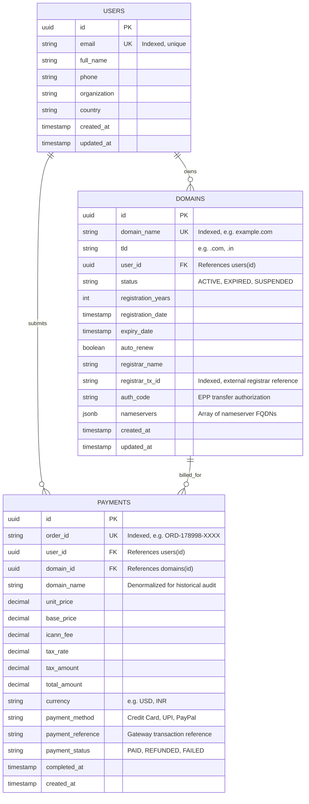

# Database Schema Design

## Overview
This document specifies the relational database schema designed for transitioning the checkout system from local file/in-memory storage to a production database (PostgreSQL, MySQL, or SQLite).

The design satisfies the following requirements:
1. **`users` table**: Stores customer identity, contact info, and WHOIS profile, with a 1-to-Many relationship to their owned domains.
2. **`domains` table**: Stores **strictly the domains that have been purchased**, including registration & expiry dates, authoritative nameservers, registrar transaction references, and transfer authorization codes (EPP auth codes).
3. **`payments` table**: Records financial transactions, linking the purchasing user and the bought domain with tax breakdown, transaction references, payment gateway status, and billing audit trails.

---

## Entity-Relationship (ER) Diagram



---

## SQL DDL (PostgreSQL / MySQL Compatible)

```sql
-- Enable UUID extension if using PostgreSQL
CREATE EXTENSION IF NOT EXISTS "uuid-ossp";

-- 1. USERS TABLE
CREATE TABLE users (
    id UUID PRIMARY KEY DEFAULT uuid_generate_v4(),
    email VARCHAR(255) NOT NULL UNIQUE,
    full_name VARCHAR(150) NOT NULL,
    phone VARCHAR(50),
    organization VARCHAR(150) DEFAULT 'Individual',
    country VARCHAR(10) DEFAULT 'IN',
    created_at TIMESTAMP WITH TIME ZONE DEFAULT CURRENT_TIMESTAMP,
    updated_at TIMESTAMP WITH TIME ZONE DEFAULT CURRENT_TIMESTAMP
);

CREATE INDEX idx_users_email ON users(email);

-- 2. DOMAINS TABLE (Stores ONLY purchased domains)
CREATE TABLE domains (
    id UUID PRIMARY KEY DEFAULT uuid_generate_v4(),
    domain_name VARCHAR(255) NOT NULL UNIQUE,
    tld VARCHAR(30) NOT NULL,
    user_id UUID NOT NULL REFERENCES users(id) ON DELETE RESTRICT,
    status VARCHAR(50) DEFAULT 'ACTIVE', -- ACTIVE, EXPIRED, LOCKED
    registration_years INT NOT NULL DEFAULT 1,
    registration_date TIMESTAMP WITH TIME ZONE NOT NULL,
    expiry_date TIMESTAMP WITH TIME ZONE NOT NULL,
    auto_renew BOOLEAN DEFAULT TRUE,
    registrar_name VARCHAR(150) NOT NULL,
    registrar_tx_id VARCHAR(100) NOT NULL,
    auth_code VARCHAR(100) NOT NULL,
    nameservers JSONB NOT NULL DEFAULT '["ns1.godaddy-gateway.com", "ns2.godaddy-gateway.com"]',
    created_at TIMESTAMP WITH TIME ZONE DEFAULT CURRENT_TIMESTAMP,
    updated_at TIMESTAMP WITH TIME ZONE DEFAULT CURRENT_TIMESTAMP
);

CREATE INDEX idx_domains_name ON domains(domain_name);
CREATE INDEX idx_domains_user_id ON domains(user_id);
CREATE INDEX idx_domains_expiry ON domains(expiry_date);

-- 3. PAYMENTS TABLE
CREATE TABLE payments (
    id UUID PRIMARY KEY DEFAULT uuid_generate_v4(),
    order_id VARCHAR(100) NOT NULL UNIQUE,
    user_id UUID NOT NULL REFERENCES users(id) ON DELETE RESTRICT,
    domain_id UUID NOT NULL REFERENCES domains(id) ON DELETE RESTRICT,
    domain_name VARCHAR(255) NOT NULL,
    unit_price NUMERIC(10, 2) NOT NULL,
    base_price NUMERIC(10, 2) NOT NULL,
    icann_fee NUMERIC(10, 2) NOT NULL DEFAULT 0.18,
    tax_rate NUMERIC(4, 2) NOT NULL,
    tax_amount NUMERIC(10, 2) NOT NULL,
    total_amount NUMERIC(10, 2) NOT NULL,
    currency VARCHAR(10) NOT NULL DEFAULT 'USD',
    payment_method VARCHAR(50) NOT NULL,
    payment_reference VARCHAR(100) NOT NULL,
    payment_status VARCHAR(50) DEFAULT 'PAID', -- PAID, REFUNDED, FAILED
    completed_at TIMESTAMP WITH TIME ZONE NOT NULL,
    created_at TIMESTAMP WITH TIME ZONE DEFAULT CURRENT_TIMESTAMP
);

CREATE INDEX idx_payments_order_id ON payments(order_id);
CREATE INDEX idx_payments_user_id ON payments(user_id);
CREATE INDEX idx_payments_domain_id ON payments(domain_id);
```

---

## Prisma Schema (`schema.prisma`)

```prisma
datasource db {
  provider = "postgresql"
  url      = env("DATABASE_URL")
}

generator client {
  provider = "prisma-client-js"
}

model User {
  id           String    @id @default(uuid())
  email        String    @unique
  fullName     String    @map("full_name")
  phone        String?
  organization String?   @default("Individual")
  country      String?   @default("IN")
  createdAt    DateTime  @default(now()) @map("created_at")
  updatedAt    DateTime  @updatedAt @map("updated_at")

  // Relationships
  domains      Domain[]
  payments     Payment[]

  @@map("users")
}

model Domain {
  id                String    @id @default(uuid())
  domainName        String    @unique @map("domain_name")
  tld               String
  userId            String    @map("user_id")
  status            String    @default("ACTIVE")
  registrationYears Int       @default(1) @map("registration_years")
  registrationDate  DateTime  @map("registration_date")
  expiryDate        DateTime  @map("expiry_date")
  autoRenew         Boolean   @default(true) @map("auto_renew")
  registrarName     String    @map("registrar_name")
  registrarTxId     String    @map("registrar_tx_id")
  authCode          String    @map("auth_code")
  nameservers       String[]  @default(["ns1.godaddy-gateway.com", "ns2.godaddy-gateway.com"])
  createdAt         DateTime  @default(now()) @map("created_at")
  updatedAt         DateTime  @updatedAt @map("updated_at")

  // Relationships
  owner             User      @relation(fields: [userId], references: [id], onDelete: Restrict)
  payments          Payment[]

  @@map("domains")
}

model Payment {
  id               String   @id @default(uuid())
  orderId          String   @unique @map("order_id")
  userId           String   @map("user_id")
  domainId         String   @map("domain_id")
  domainName       String   @map("domain_name")
  unitPrice        Decimal  @map("unit_price") @db.Decimal(10, 2)
  basePrice        Decimal  @map("base_price") @db.Decimal(10, 2)
  icannFee         Decimal  @default(0.18) @map("icann_fee") @db.Decimal(10, 2)
  taxRate          Decimal  @map("tax_rate") @db.Decimal(4, 2)
  taxAmount        Decimal  @map("tax_amount") @db.Decimal(10, 2)
  totalAmount      Decimal  @map("total_amount") @db.Decimal(10, 2)
  currency         String   @default("USD")
  paymentMethod    String   @map("payment_method")
  paymentReference String   @map("payment_reference")
  paymentStatus    String   @default("PAID") @map("payment_status")
  completedAt      DateTime @map("completed_at")
  createdAt        DateTime @default(now()) @map("created_at")

  // Relationships
  user             User     @relation(fields: [userId], references: [id], onDelete: Restrict)
  domain           Domain   @relation(fields: [domainId], references: [id], onDelete: Restrict)

  @@map("payments")
}
```

---

## Design Highlights & Key Guarantees
1. **Bought Domains Only**: Unpurchased domains do not occupy storage space. The system dynamically evaluates availability in memory, and writes to `domains` strictly upon successful checkout.
2. **Referential Integrity**: 
   - `domains.user_id` enforces valid ownership linked to a verified user profile.
   - `ON DELETE RESTRICT` prevents accidental deletion of user accounts that own active registered domains.
3. **Auditability**: `payments` stores a denormalized `domain_name` and full tax/fee calculation snapshot, ensuring financial audit compliance even if domain settings change in the future.
4. **Fast Queries**:
   - `idx_users_email` enables fast lookups for customer dashboard (`/api/checkout/my-domains`).
   - `idx_domains_name` guarantees $O(1)$ availability verification during checkout.
